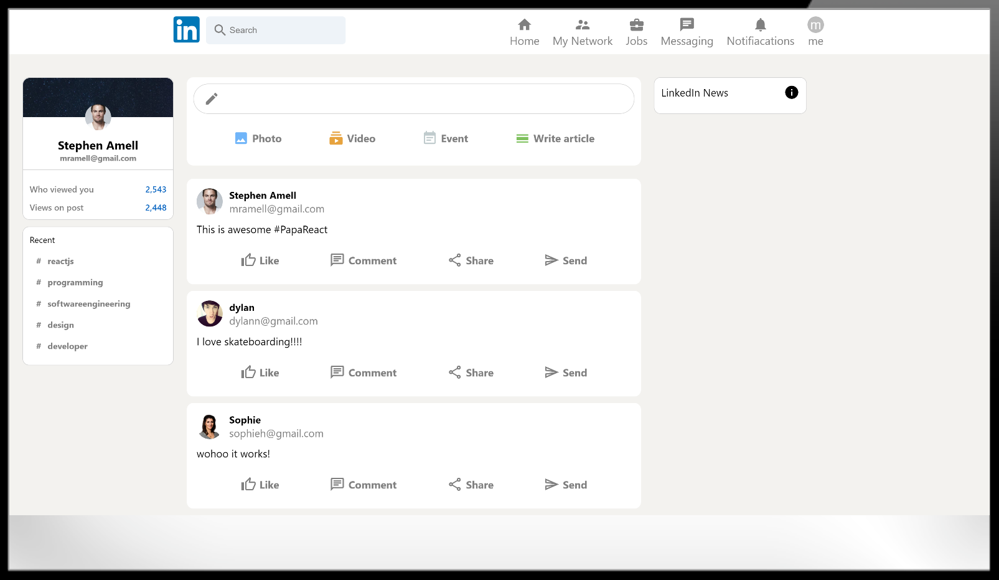

# LinkedIn Clone

This project is created with [React](https://reactjs.org/) , using [Redux](https://redux.js.org/) and [Redux Toolkit](https://redux-toolkit.js.org/) and hosted on [Firebase](https://firebase.google.com/). 

## Technologies Used:
- [Javascript](https://www.javascript.com/)
- [Redux](https://redux.js.org/)  
- [React Flip Move](https://www.npmjs.com/package/react-flip-move) 
- [React](https://reactjs.org/)
- [Material-Ui](https://material-ui.com/)
- [Nodejs](https://nodejs.org/en/)
- [Firebase](https://firebase.google.com/)

## Deploy to Firebase:
- firebase login
- firebase init
    - Hosting
   - Use existing project
    - build
- npm run buid
- firebase deploy

## Credits
[Let's build LinkedIn with REACT.JS! (with Redux & Firebase)](https://www.youtube.com/watch?v=QaYts9sPmcY&ab_channel=SonnySangha)